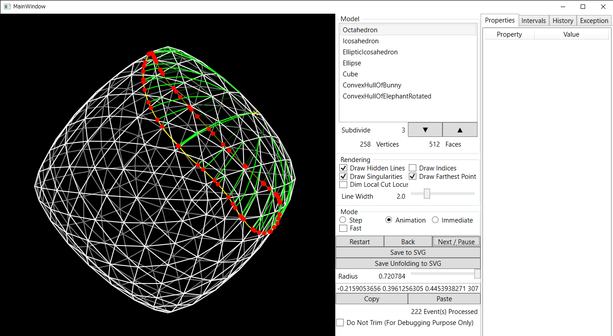

Computation and visualization of geodesics, wavefront and cut locus on convex polyhedra by interval propagation, written in C#. This solution contains two executable projects *ConsoleProgram* and *IntervalWavefrontViewer*. The actual logic of the propagation is implemented in the project *IntervalWavefront*.

# ModelData
The *ModelData* directory contains several convex polyhedra ready to be used in the programs. A model file is a human-readable text file made up of
* the 3D coordinates of the vertices;
* the zero-based indices of the vertices of the triangular faces.

# ConsoleProgram
The project *ConsoleProgram* demonstrates workflow of reading data, subdividing the mesh, selecting the source point, running the algorithm and generating SVGs for source unfolding and perspective-projected view without GUI. It works on all platforms that support .NET Core 6.

## How to run
Prerequisite: .NET Core 6.0

To run this program, you can use the command `dotnet run --project ConsoleProgram` in the terminal. After the program finishes, the files *unfolding.svg* and *view.svg* are created.

# IntervalWavefrontViewer
The project *IntervalWavefrontViewer* is a GUI application to interactively select a source point and visualize wavefront and cut locus, and some geodesics connecting the source point and interactively selected end point. It works only on Windows.

## How to build
Prerequisites: .NET Core 6.0 and Microsoft Windows.

To build this program, you can use Visual Studio 2022 or the command `dotnet build IntervalWavefrontViewer` in the terminal.

## How to use
* You can select a model in the Model listbox.
* You can subdivide the model using the Loop subdivision algorithm. Do not subdivide the ConvexHullOfBunny or ConvexHullOfElephantRotated model (or your similar models) since it yields nonconvex polyhedron.
* You can drag the model to rotate.
* You can use the mouse wheel on the model to zoom in/out.
* You can select a execution mode:
	* The Step mode executes step by step using the "Next / Pause" button or the Enter key.
	* The Animation mode enables animated execution. You can pause or resume the execution using the "Next / Pause" button.
	* The Immediate mode executes the whole algorithm immediately.
	* The Fast checkbox determines how many events are processed at once in the Step or Animation mode. If checked, it is the number of events of the current event queue. Otherwise, it is 1.
* You can click the model to select the source point and start the algorithm. Alternatively you can use the text box to manually specify source's 3D coordinates and zero-based index of the face.
* In the middle of algorithm execution:
	* The next event point is shown as a red square and its associated interval is automatically selected.
	* You can select the previous/next interval of the selected one, by pressing the Left/Right arrow key.
	* The Properties tab shows the items of the selected interval.
	* The Intervals tab shows the intervals of the current wavefront.
	* The History tab shows all processed events.
* After the algorithm finished:
	* The cut locus is drawn in green.
	* The farthest point is drawn as a yellow circle.
	* You can view the geodesics between the source point and an arbitrary point by holding the Shift key and hovering the mouse pointer.
